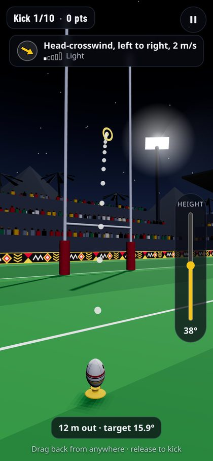
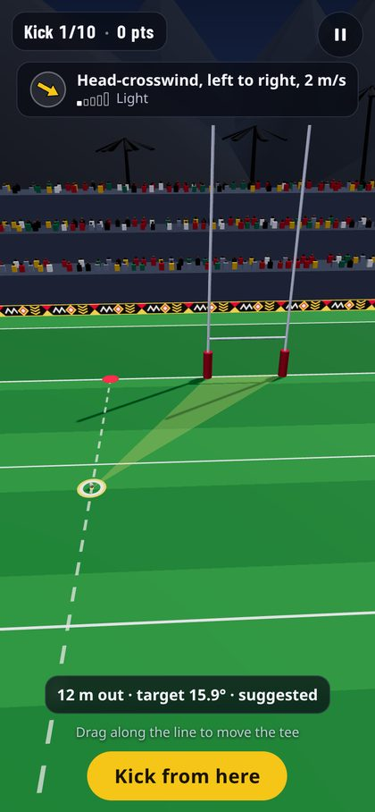
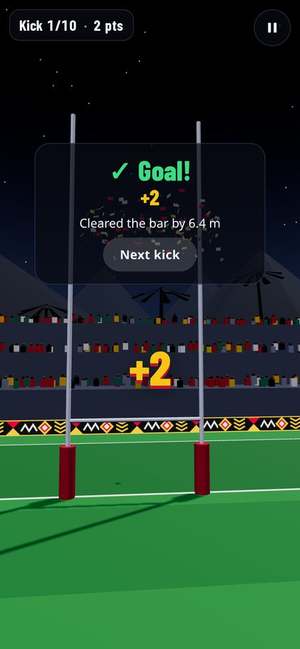
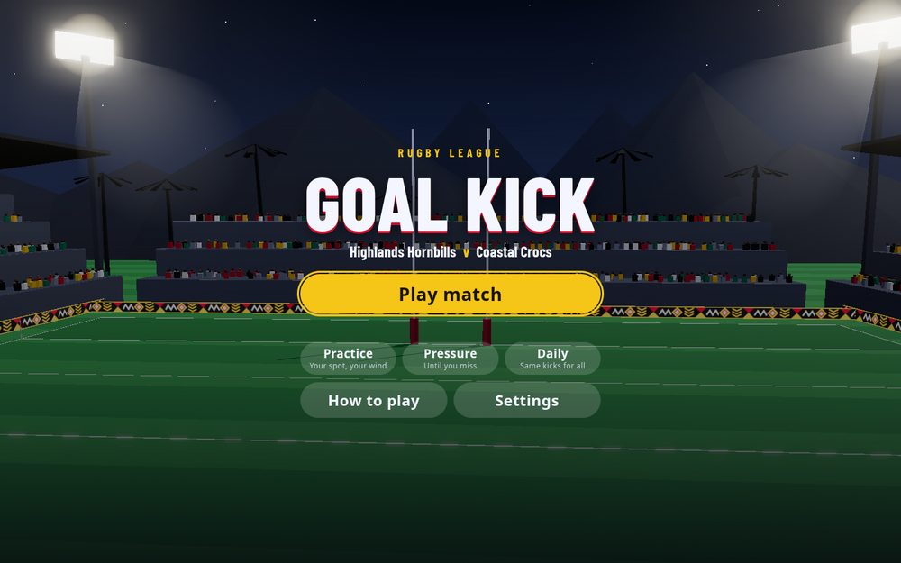

# Rugby Goal Kick

[](https://opensource.org/licenses/MIT)
[](https://threejs.org/)
[](https://vite.dev/)
[](https://web.dev/explore/progressive-web-apps)

**Browser 3D rugby league goal-kicking game in Three.js and Vite, with wind physics, four modes, and offline play as an installable app.**

You take conversions at a ground in Papua New Guinea under floodlights, on a phone or a desktop. Choose your spot on the conversion line, read the wind, and kick the ball between the posts. All geometry, textures, sound and music are generated in code. The game loads no image, model or audio files, and its only runtime dependencies are Three.js and a self-hosted font.

<p>
  
  
  
</p>


## Features

- **League conversion rules**: posts 5.5 m apart, crossbar at 3 m, 2 points for a conversion. You choose the tee position anywhere on the line straight back from the try
- **Wind and ball flight** use a 120 Hz simulation with drag. The ball can hit the uprights or crossbar, then go in or bounce out
- **Aim preview** uses the same simulation as the kick, so the dotted arc shows exactly where the ball goes. On later kicks, less of the arc shows
- **Results tell you why you missed**, for example *"Missed by 0.6 m · Wind carried it 1.2 m left"*
- **Four modes**: Match, Practice, Pressure and Daily, plus an interactive tutorial
- **Touch, mouse, keyboard and gamepad** controls. You can remap the keys, and there is a left-handed layout
- **Accessibility**: text size, high contrast, reduce motion, assists for the meter and preview, and screen reader announcements. No information is shown by colour alone
- **Installable PWA** that works offline after the first visit

## How to play

The fastest path from page load to your first kick is two taps: **Play match**, then **Kick from here**.

1. **Place the tee.** If you step back, the angle to the posts is wider but the kick is longer. The gold ring is a good spot.
2. **Aim, set the height, choose the power.** The dotted arc and the ring at the posts show where the ball will go, with the wind included.
3. **Read the result.** Each result card gives the distance of the miss and the cause.

### Controls

| | Touch / mouse | Keyboard (remappable) | Gamepad |
|---|---|---|---|
| Move the tee | Drag along the line | ↑ ↓ or W S | Left stick up/down |
| Confirm the tee | **Kick from here** | Space / Enter | A |
| Aim | Drag back from anywhere (slingshot): pull left to aim right | ← → or A D (Shift = fine) | Left stick (right stick = fine) |
| Height | **Height** slider (or mouse wheel) | ↑ ↓ or W S | Left stick up/down |
| Power | How far you pull back; release to kick | Space starts the timing meter, Space again kicks | A or RT, twice |
| Cancel a drag | Drag back to where you started | | |
| Pause | ⏸ button | Esc / P | Start |
| Mute | Settings | M | |

### Modes

| Mode | Rules |
|------|-------|
| **Match** | 10 conversions. The first three are gentle, then each kick has a wider try, stronger wind (up to 10 m/s), a faster meter and a shorter preview. The last three have no preview. The game saves your best score and best streak |
| **Practice** | Choose the try spot, the wind and the length of the preview. The kicks are unlimited, and a heat map at the posts shows your last eight |
| **Pressure** | Keep scoring until you miss. Each kick is harder, the preview fades out, and a shot clock runs |
| **Daily** | Ten kicks for today. Everyone gets the same kicks |
| **How to play** | A tutorial of one interactive kick. It also runs at the start of your first match |

### Settings

| Group | Options |
|-------|---------|
| Controls | Aim sensitivity, invert drag aim, left-handed layout, key remapping, always use the suggested spot |
| Assists | Slower meter, longer preview |
| Audio | Master, Effects, Crowd and Music volumes, mute, vibration |
| Display | Text size, high contrast, reduce motion (follows the system setting by default), floodlight glow (bloom) |

The game remembers all of your settings. All menus work with a keyboard, a gamepad and a screen reader.

## How it works

- **One simulation.** The game simulates the kick once at contact with semi-implicit Euler at 120 Hz, using gravity and quadratic drag relative to the wind. Then it plays the result back sample by sample. The aim preview calls the same `simulate()`, so the preview, the flight and the result always agree. The simulation has no hidden randomness.
- **Collisions** use a swept sphere against cylinders for the uprights and the crossbar. The game finds the goal plane from the segment that crosses it before the ball first touches the ground.
- **Pure core.** `physics/`, `game/round.js`, `game/meter.js`, `core/` and `settings/storage.js` do not import Three.js or use the DOM, so the unit tests run them in Node.
- **Look.** The floodlit night style is a preset in `world/lookdev.js`. Each world mesh has a role, and a preset replaces the material for each role. Bloom loads only when you need it, and the shadow map updates only when the ball moves.
- **Performance.** The pixel ratio has a maximum of 2. The resolution decreases on slow frames and increases again when there is spare time. The loop stops when the game pauses or the tab is hidden.

For the full architecture, refer to [CLAUDE.md](CLAUDE.md).

## Project layout

```text
rugby-goalkick/
├── index.html            # Page shell, HUD and menu markup
├── style.css             # UI styles and :root colour tokens
├── vite.config.js        # Build target and PWA manifest / service worker
├── src/
│   ├── main.js           # App flow: title, match, pause, settings, summary
│   ├── config.js         # Field, posts and tuning constants
│   ├── physics/          # simulate, wind, conversion line, miss explanations
│   ├── game/             # Kick state machine, rounds, timing meter
│   ├── modes/            # Match, Practice, Pressure, Daily
│   ├── core/             # Loop, clock, seeded RNG, events
│   ├── world/            # Three.js scene: field, posts, stadium, crowd, sky, fx
│   ├── audio/            # Synthesised effects, crowd and music
│   ├── input/            # Touch, mouse, keyboard, gamepad, key bindings
│   ├── ui/               # HUD, screens, tutorial, haptics, motion
│   ├── settings/         # Settings, best scores, storage
│   └── debug/            # window.__game hook (dev only)
├── test/                 # Vitest: physics, scoring, modes, storage
├── scripts/              # Playwright screenshots, smoke, offline, lookdev; icon render
├── public/icons/         # PWA icons (rendered from icon.svg)
└── docs/                 # Revamp plan and screenshots
```

## Setup

You need Node.js 18 or later.

```bash
git clone https://github.com/n30dyn4m1c/rugbygoalkick.git
cd rugbygoalkick
npm install
npm run dev        # http://localhost:5173
```

### Scripts

| Command | What it does |
|---------|--------------|
| `npm run dev` | Dev server, with the `window.__game` debug hook |
| `npm test` | Vitest unit tests for the pure modules |
| `npm run build` | Production build to `dist/` |
| `npm run preview` | Serve `dist/` |
| `npm run screenshots` | Playwright: every screen at 390×844, 844×390 and 1440×900, to `screenshots/` |
| `npm run smoke` | Playwright: real touch and keyboard input checks |
| `npm run check:offline` | Playwright: the production build installs a service worker and plays offline |
| `npm run lookdev` | Playwright: art-direction presets and a relative performance probe |
| `npm run icons` | Render the PWA icons again from `public/icons/icon.svg` |

## Notes

- You may need to run `npx playwright install chromium` one time before you use the Playwright scripts. The screenshot and smoke scripts use software WebGL (SwiftShader), so they run on all machines. Their frame rates do not show the performance on real devices.
- The game, art, sound and music are original, and the code generates them. The pattern boards use abstract geometric bands in red, black and gold. The menu groove is a synthesised hand-drum pattern in the style of the kundu. It is not a recording or a specific traditional rhythm. The team names are fictional.

## License

This project is licensed under the [MIT License](LICENSE).

## Author

**Neo Malesa** — [n30dyn4m1c](https://github.com/n30dyn4m1c)
